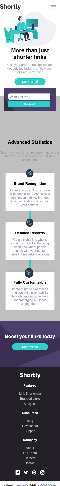
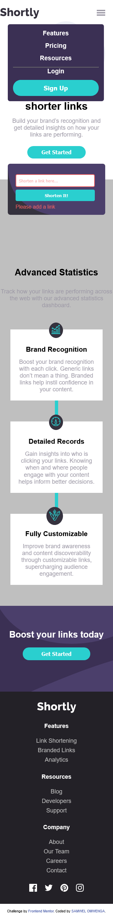
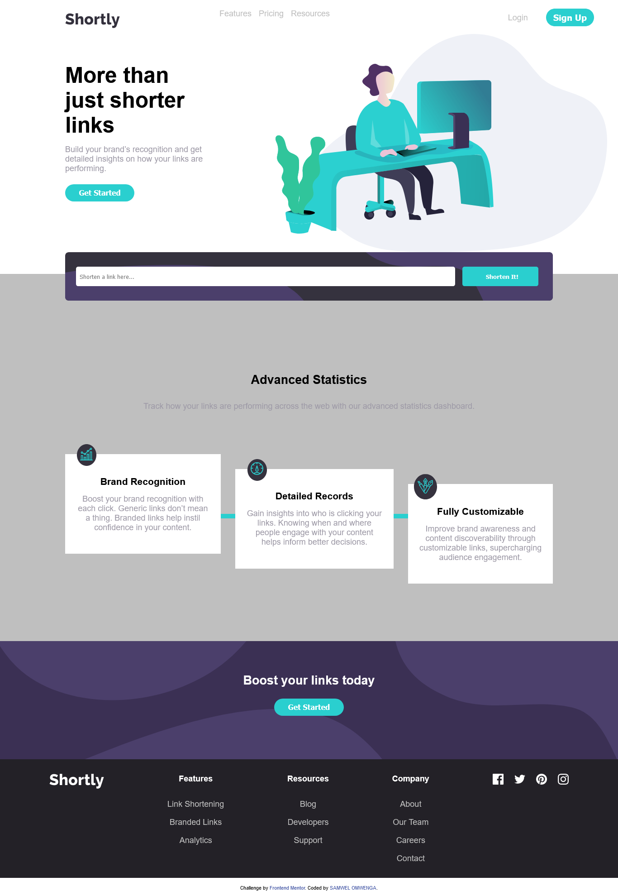
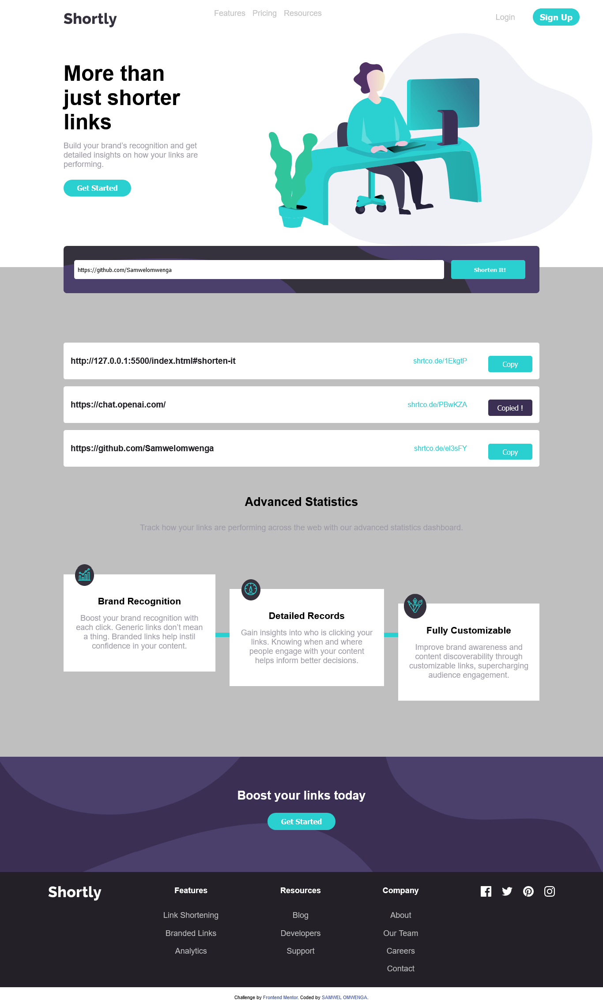
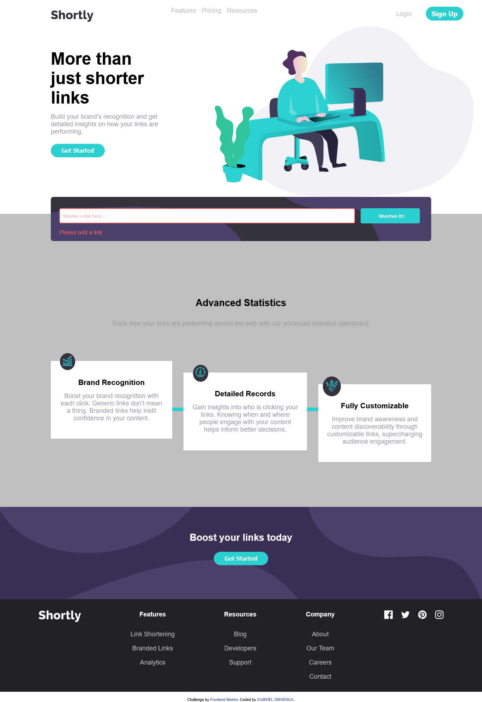

# Frontend Mentor - Shortly URL shortening API Challenge solution

This is a solution to the [Shortly URL shortening API Challenge challenge on Frontend Mentor](https://www.frontendmentor.io/challenges/url-shortening-api-landing-page-2ce3ob-G). Frontend Mentor challenges help you improve your coding skills by building realistic projects. 

## Table of contents

- [Overview](#overview)
  - [The challenge](#the-challenge)
  - [Screenshot](#screenshot)
  - [Links](#links)
- [My process](#my-process)
  - [Built with](#built-with)
  - [What I learned](#what-i-learned)
  - [Useful resources](#useful-resources)
- [Author](#author)

**Note: Delete this note and update the table of contents based on what sections you keep.**

## Overview

### The challenge

Users should be able to:

- View the optimal layout for the site depending on their device's screen size
- Shorten any valid URL
- See a list of their shortened links, even after refreshing the browser
- Copy the shortened link to their clipboard in a single click
- Receive an error message when the `form` is submitted if:
  - The `input` field is empty

### Screenshot








### Links

- Solution URL: [Add solution URL here](https://github.com/Samwelomwenga/url-shortening-api)
- Live Site URL: [Add live site URL here](https://samwelomwenga.github.io/url-shortening-api/)

## My process

### Built with

- Semantic HTML5 markup
- CSS custom properties
- Flexbox
- CSS Grid
- Mobile-first workflow
- vannila JavaScript


### What I learned


```js
const render = async () => {
  const localKey = await toLocaleStorage();
  const localData = JSON.parse(localStorage.getItem(localKey));
  const { code, short_link, original_link } = localData;
  shortenHistoryContainer.insertAdjacentHTML(
    "beforebegin",
    `
<div class="shorten-history">
<h3>

<a href="${original_link}" target="_blank" class="original-link"> ${original_link}</a></h3>
<hr>
<div>
  <p>
  <a class="short-link" href="${short_link}" target="_blank" > ${short_link}</a>
 </p>
<button data-copied
="false" class="copy-button" data-short-link="${short_link}" onclick="handleCopyData(this)">Copy</button>
</div>
</div>`
  );
};


function handleCopyData(copyButton){
  if (navigator.clipboard) {
    try {
      navigator.clipboard.writeText(copyButton.dataset.shortLink);
      if (copyButton.dataset.copied==='false') {
        copyButton.setAttribute('data-copied',true);
        copyButton.innerHTML="Copied !"
      }
    } catch (error) {
      console.error(error.message)
    }
  }
}

const handleDataError = () => {
  shortenUrl.setCustomValidity("");
  const valid = shortenUrl.checkValidity();
  const dataError = document.querySelector("[data-error-message]");
  if (!valid) {
    dataError.setAttribute("data-error-message", true);
    dataError.innerHTML = "Please add a link";
    shortenUrl.setAttribute("data-valid", false);
  }
  shortenUrl.addEventListener("focus", () => {
    dataError.setAttribute("data-error-message", false);
    shortenUrl.setAttribute("data-valid", true);
  });
};
```


### Useful resources

- (https://javascript.info/localstorage) - This help in learning how  local storage work in JavaScript
- (https://javascript.info/modifying-document) - This help in learning how  insertion of element to dom work in JavaScript
*

## Author

- Website - [SAMWEL OMWENGA](https://www.your-site.com)
- Frontend Mentor - [@Samwelomwenga](https://www.frontendmentor.io/profile/Samwelomwenga)


